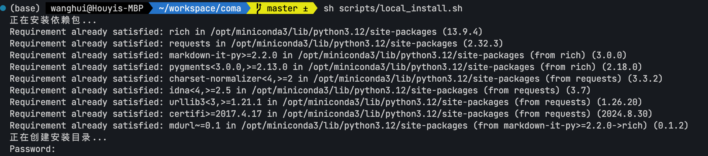
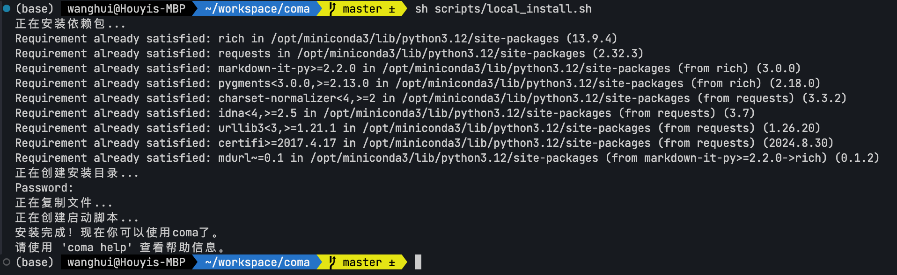
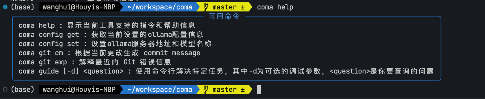
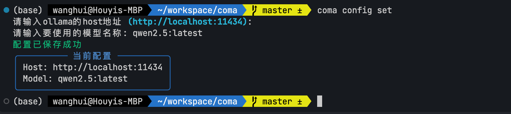
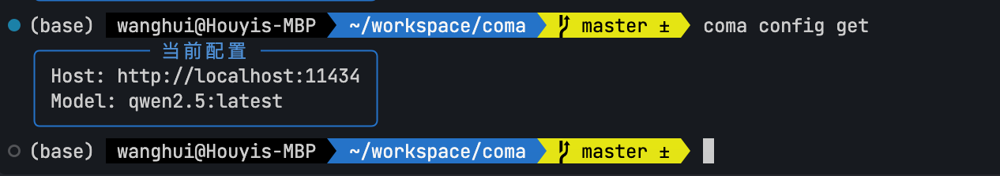
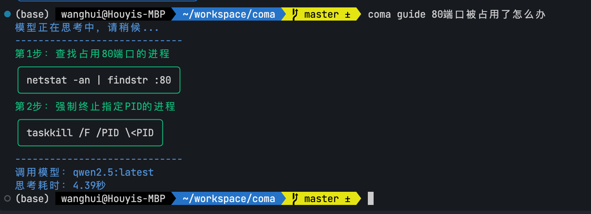
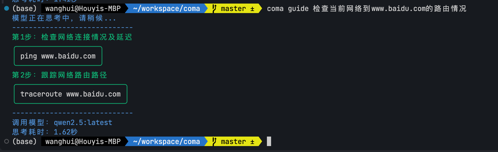
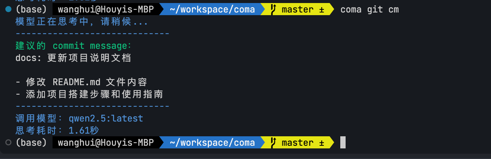

# 项目介绍
coma(Command Assistant)是一个基于python的命令行工具，通过与大模型进行交互获得解决问题的能力。

# 本地安装
```sh
git clone https://github.com/all4you/cmdhelp
cd cmdhelp
sh scripts/local_install.sh
```




# 在线安装
```sh
curl -fsSL https://raw.githubusercontent.com/all4you/cmdhelp/blob/master/scripts/install.sh | bash
```

# 卸载
```sh
curl -fsSL https://raw.githubusercontent.com/all4you/cmdhelp/blob/master/scripts/uninstall.sh | bash
```

# 使用
## coma help


## coma config set


## coma config get


## coma guide



## coma git cm

